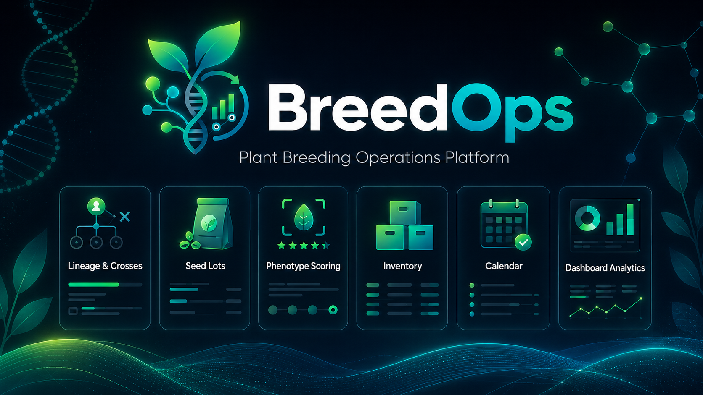
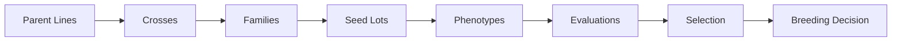
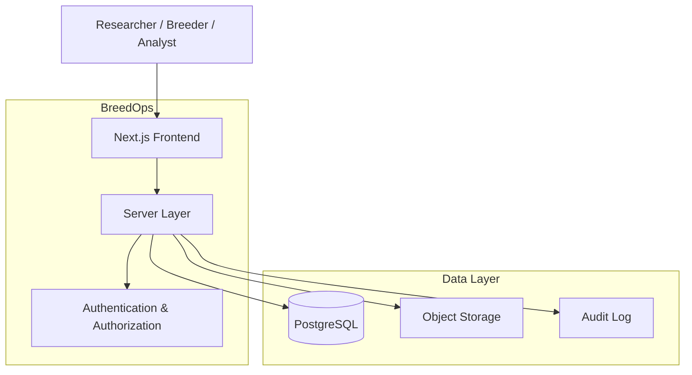
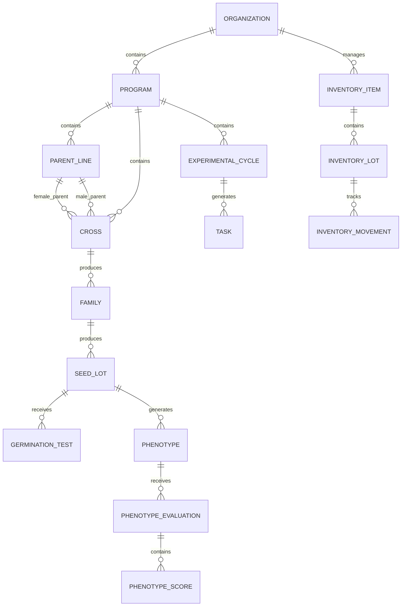

<p align="center">
  
</p>

<p align="center">
  
</p>

<!--
When an animated logo is available, replace the image above with:

-->

<h1 align="center">BreedOps</h1>

<p align="center">
  <strong>The operating platform for modern plant breeding.</strong>
</p>

<p align="center">
  A secure, data-driven workspace connecting genetics, crosses, seed lots, phenotyping,<br>
  inventory, experimental workflows, traceability, and breeding analytics.
</p>

<p align="center">
  <a href="#overview">Overview</a> ·
  <a href="#from-cross-to-decision">Workflow</a> ·
  <a href="#core-platform">Platform</a> ·
  <a href="#architecture">Architecture</a> ·
  <a href="#data-model">Data Model</a> ·
  <a href="#quick-start">Quick Start</a> ·
  <a href="#roadmap">Roadmap</a>
</p>

<p align="center">
  
  
  
  
  
  
</p>

---

## Overview

**BreedOps centralizes the operational backbone of a modern breeding program.** Instead of scattering information across spreadsheets, disconnected lab notes, local folders, and ad hoc tracking files, BreedOps organizes the full breeding workflow in one traceable system.

| Genetics & material | Experiments & operations | Decisions & governance |
|---|---|---|
| Parent lines | Phenotype evaluations | Quality control |
| Crosses & families | Inventory & stock movements | Audit trails |
| Seed lots | Experimental cycles & task planning | Dashboards & breeding decisions |

BreedOps is designed for **research teams, breeding programs, floriculture pipelines, and scientific plant-improvement workflows** that require both **traceability** and **operational efficiency**.

### Why BreedOps?

Modern breeding programs generate complex, multi-layered data spanning **genetic lineage and crossing records**, **propagation and seed-lot history**, **phenotype scoring and weighted selection**, **reagent and equipment tracking**, **experimental calendars and compliance workflows**, and **progress monitoring and reporting**.

BreedOps transforms these fragmented records into a **secure, structured, and actionable platform for breeding operations management**.

---

## From Cross to Decision



<p align="center"><strong>BreedOps transforms breeding records into traceable selection decisions.</strong></p>

---

## Core Platform

<details open>
<summary><strong>🧬 Genetics & Lineage</strong></summary>

BreedOps manages the upstream genetic and crossing workflow and preserves the historical chain between records.

- Parent lines and cross registry
- Family and generational tracking
- Seed lots and germination testing
- Genetic verification and lot status
- Historical linkage and traceable records

</details>

<details>
<summary><strong>🌱 Phenotyping & Selection</strong></summary>

BreedOps supports structured and weighted evaluation of breeding material.

- Phenotype registry and evaluation models
- Configurable weighted criteria and coefficients
- Evaluator and reviewer workflows
- Automatic and normalized score calculation
- Automated decision categories
- Elite candidate identification
- Ranking and comparison between individuals

**Example selection logic**

```text
Weighted Score =
  Vigor × 1
+ Architecture × 1
+ Yield × 2
+ Sanitary Quality × 2
+ Analytical Quality × 3
+ Stability × 4
```

</details>

<details>
<summary><strong>📦 Inventory & Laboratory Operations</strong></summary>

BreedOps connects breeding workflows to laboratory and operational logistics.

- Inventory items, reagents, consumables, and lots
- Equipment registry
- Stock levels, stock movements, and consumption history
- Minimum-stock thresholds and operational alerts
- Expiration dates and storage conditions
- PPE and compliance information

</details>

<details>
<summary><strong>📅 Experimental Workflow & Scheduling</strong></summary>

BreedOps structures experimental execution from reusable templates to milestone validation.

- Experimental cycles and task templates
- Priorities, deadlines, zones, and locations
- Calendar and Gantt views
- SOP compliance
- Deliverables and milestone validation
- Delay calculation and operational alerts

</details>

<details>
<summary><strong>📊 Dashboard, Analytics & Reporting</strong></summary>

BreedOps provides a high-level view of breeding progress and operational bottlenecks.

- Active crosses and seed lots
- Germination trends and performance
- Phenotype selection outcomes
- Inventory alerts
- Task progress, delayed tasks, and overall progress
- Quality-control indicators
- Cross-family comparison
- Program-level KPI monitoring

</details>

---

## Breeding Intelligence Snapshot

### Selection score example

| Trait | Weight | Score | Weighted contribution |
|---|:---:|:---:|:---:|
| Vigor | ×1 | 8/10 | 8 |
| Architecture | ×1 | 9/10 | 9 |
| Yield | ×2 | 8/10 | 16 |
| Quality | ×2 | 9/10 | 18 |
| Analytical trait | ×3 | 9/10 | 27 |
| Stability | ×4 | 10/10 | 40 |

> **Weighted score:** `115 / 130` · **Normalized score:** `88.5%` · **Decision:** ★ **ELITE**

---

## Feature Matrix

| Domain | Capability | MVP | Future |
|---|---|:---:|:---:|
| 🧬 Genetics | Parent lines | ✅ | — |
| 🧬 Genetics | Cross registry | ✅ | — |
| 🧬 Genetics | Families | ✅ | — |
| 🧬 Genetics | Seed lots | ✅ | — |
| 🧬 Genetics | Interactive pedigree | — | 🔜 |
| 🌱 Phenotyping | Weighted scoring | ✅ | — |
| 🌱 Phenotyping | Selection models | ✅ | — |
| 🌱 Phenotyping | Image-assisted scoring | — | 🔜 |
| 📦 Inventory | Stock movements | ✅ | — |
| 📦 Inventory | Expiration alerts | ✅ | — |
| 📦 Inventory | QR-based traceability | — | 🔜 |
| 📅 Workflow | Calendar | ✅ | — |
| 📅 Workflow | Gantt | ✅ | — |
| 📅 Workflow | Notifications | — | 🔜 |
| 📊 Analytics | Dashboard | ✅ | — |
| 📊 Analytics | Advanced statistics | — | 🔬 |
| 🛡️ Platform | Security and audit | ✅ | — |
| 🛡️ Platform | Offline sync | — | 🔜 |

---

## Architecture



### Technology stack

| Layer | Technology |
|---|---|
| Frontend | Next.js · React · TypeScript · Tailwind CSS |
| Backend | Next.js server layer · Supabase |
| Database | PostgreSQL |
| Authentication | Supabase Auth |
| Security | Row-Level Security (RLS) · role-based access control |
| Validation | Zod |
| Forms | React Hook Form |
| Tables | TanStack Table |
| Testing | Unit · integration · end-to-end |
| Deployment | Web-ready SaaS architecture |

---

## Data Model



---

## Security by Design

BreedOps is designed with **security, data integrity, and traceability** as core principles.

<details open>
<summary><strong>Security foundations</strong></summary>

- Authentication required
- Role-based access control
- Server-side authorization
- PostgreSQL Row-Level Security
- Organization-level and program-level data isolation
- Audit logging
- Soft deletion for critical scientific records
- Versioned migrations
- Controlled imports and exports
- Traceable modifications to sensitive data

</details>

<details>
<summary><strong>Target roles</strong></summary>

- `system_admin`
- `organization_admin`
- `program_manager`
- `technician`
- `analyst`
- `viewer`
- `auditor`

</details>

> [!IMPORTANT]
> Security features should only be presented as production guarantees once the corresponding controls are fully implemented, tested, and verified.

---

## Repository Structure

```text
BreedOps/
├── assets/
│   ├── breedops_logo.png
│   └── breedops_banner.png
├── docs/
├── src/
├── supabase/
├── tests/
├── PROMPT.md
├── CLAUDE.md
├── agend.md
├── README.md
└── ...
```

---

## Quick Start

> [!NOTE]
> The setup below assumes the application stack is initialized with **Next.js + TypeScript + Supabase**.

### 1. Clone

```bash
git clone https://github.com/El-Castor/BreedOps.git
cd BreedOps
```

### 2. Install dependencies

```bash
npm install
```

### 3. Configure the environment

```bash
cp .env.example .env.local
```

Fill in the required variables in `.env.local`. **Never commit secrets or production credentials.**

### 4. Start the development server

```bash
npm run dev
```

Then open `http://localhost:3000`.

---

## Roadmap

BreedOps is being developed in structured phases.

| Phase | Scope |
|---|---|
| **MVP** | Authentication & roles · cross registry · families & seed lots · phenotype scoring · inventory & stock movements · calendar & Gantt · dashboard & alerts |
| **V1** | Interactive pedigree · QR codes · photograph/image workflows · notifications |
| **V2** | Advanced statistical analysis · multi-year comparison · genotype × environment exploration · offline-first synchronization |
| **Future** | Genomics integration · genomic prediction · AI-assisted breeding intelligence |

### Planned future modules

- Interactive pedigree
- QR codes
- Photograph workflows
- Notifications
- Advanced breeding statistics
- Multi-year comparison
- Genotype × environment analysis
- Offline-first synchronization
- AI-assisted breeding analytics

---

## Documentation

Project documentation is intended to be organized into:

- `docs/architecture.md`
- `docs/database.md`
- `docs/security.md`
- `docs/deployment.md`
- `docs/user-guide.md`

Additional operational planning is tracked in `agend.md`.

---

## Contributing

Contributions are welcome once the base architecture is stabilized. Future contribution guidelines will cover **code style**, **branching strategy**, **migrations**, **testing expectations**, **security review requirements**, and the **pull-request workflow**.

---

## Status

> [!WARNING]
> **BreedOps is currently in active development.** Interfaces, schemas, and workflows may change before the first stable release.

The first secure MVP focuses on **breeding lineage tracking**, **phenotype selection workflows**, **inventory operations**, **experimental planning**, and **traceable analytics**.

---

## Vision

BreedOps is not only a breeding database. It is intended to become a **complete operating system for breeding operations**: a unified platform where genetics, phenotypes, inventory, workflows, quality control, and analytics converge into a single decision-making environment.

---

## License

License information will be added here.

---

## Acknowledgments

BreedOps is designed at the intersection of **plant breeding**, **floriculture operations**, **scientific data systems**, **traceability and quality control**, and **secure web-platform engineering**.

<p align="center">
  <strong>BreedOps — from crosses to cultivars.</strong>
</p>
