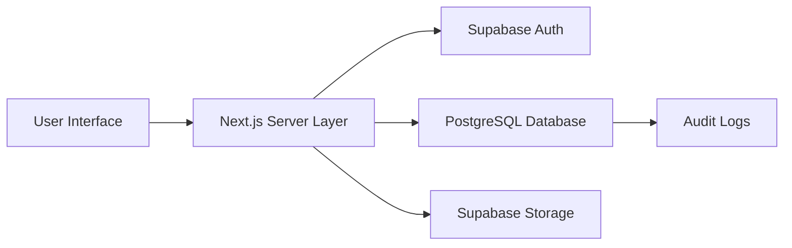

# Architecture

## Overview

Status (2026-09-20): the five V1 domains and the complete V1 authentication/user
management workflow run against local Supabase/PostgreSQL and pass unit,
integration, RLS and browser tests. The old localStorage demo is preserved in
`src/demo/local-demo.tsx` and is not routed or imported by production paths.

BreedOps is a secure, data-driven platform for plant breeding programs built on modern web technologies. The architecture is designed with security, scalability, and maintainability in mind.

## Frontend Architecture

### Next.js App Router
- Server Components by default
- Client Components for interactivity
- Server Actions for mutations
- Supabase SSR for session management

### Technology Stack
- Next.js 15+ (App Router)
- TypeScript strict mode
- React 19+
- Tailwind CSS
- React Hook Form
- Zod validation
- TanStack Table for complex data tables
- Recharts for lightweight data visualization
- date-fns for date manipulation

## Backend Architecture

### Supabase Stack
- PostgreSQL for relational data storage
- Supabase Auth for authentication
- Supabase Storage for file management (when needed)
- Row-Level Security (RLS) for data access control

### Data Flow
1. Client requests data via Next.js routes
2. Server-side code validates and processes requests
3. Supabase handles data persistence and access control
4. Data is returned to the client

## Security Design

### Authentication
- Supabase Auth for user management
- Session persistence via secure cookies (`HttpOnly`, `Secure`, `SameSite`)
- Password recovery and authenticated password changes through Supabase Auth
- MFA support planned

### Authorization
- Triple-layer security (UI, server-side, RLS)
- V1 roles: `system_admin`, `team_admin`, `user` (reaffirmed by the user 2026-09-12).
- An organization is a team; each application profile belongs to one team.
- Programs inherit team access; no program-membership hierarchy in V1.
- `system_admin` administers globally; `team_admin` administers its team and ordinary members; active team members can work on their team's business records.
- Public signup is disabled by default. When feature-enabled, signup creates only an Auth identity without a profile; RLS therefore grants no team or business access until explicit `system_admin` assignment.
- Supabase Admin API operations are confined to server-only modules and use a non-public service-role environment variable.
- Differentiated program_manager/technician/analyst/viewer roles are post-V1 candidates.
- Soft deletion for scientific records

### Data Protection
- PostgreSQL Row-Level Security (RLS)
- Parameterized queries to prevent injection attacks
- React output escaping and response security headers
- CSRF protection
- Secure cookie configuration

## Database Schema

The database schema is designed around the core concepts of plant breeding:

- Organizations and users
- Programs owned by teams
- Genetics: parent lines, crosses, families, seed lots
- Phenotyping: phenotypes, selection models, evaluations
- Inventory: items, lots, movements
- Experimental workflow: cycles, tasks, templates
- Audit log instrumentation for user invitations, creation, activation, deactivation, role/team changes and administrator password resets

## Data Flow

## Deployment Architecture

### Development
- Local development with `npm run dev`
- Next.js development server
- Supabase local development setup

### Production
- Deployment to Vercel or similar hosting platform
- Supabase for database and auth
- HTTPS enforced
- CI/CD pipeline for automated deployments

## Scalability Considerations

- Horizontal scaling of Next.js server components
- Database indexing and optimization
- RLS policies for efficient access control
- Caching strategies for frequently accessed data
- Database connection pooling
