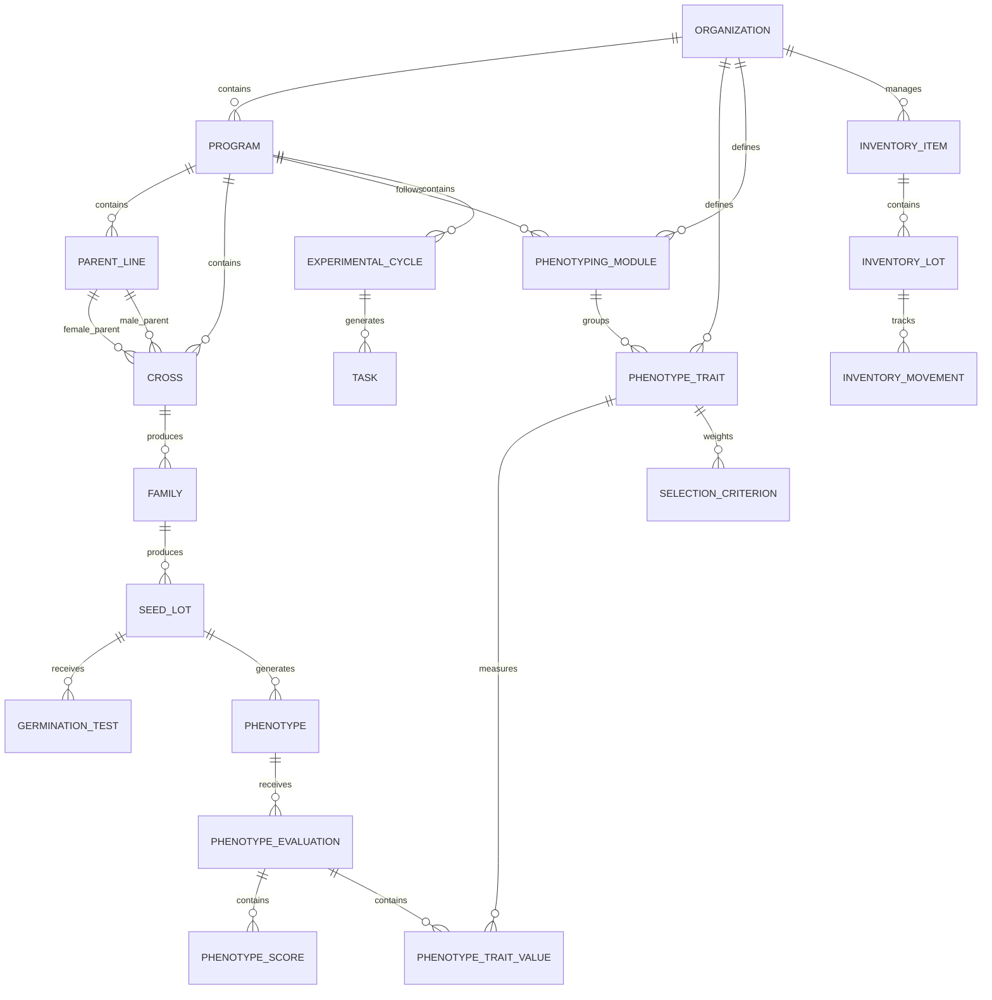

# Database Design

## Overview

BreedOps uses a PostgreSQL database with Supabase for authentication and storage. The database schema is designed to be normalized and follow the requirements in the project specification.

## Core Entities

### Organizations
Stores information about organizations using the platform.

### Profiles
Stores user profile information linked to Supabase auth users.

### Programs
Manages breeding programs within organizations.

### Team membership
Migration 000003 removes program_members. Each profile belongs to one organization/team;
program access inherits that team. V1 uses system_admin, team_admin and user.
Migration 000005 guards profile identity and privileged-role boundaries and restricts
trigger-only calculation functions. Migrations 000012–000013 implement pending-account
assignment and audited user administration. The final 25 auth/RLS assertions pass locally.

### Parent Lines
Stores information about parent lines used in crosses.

### Crosses
Records crossing events between parent lines.

### Families
Organizes crosses into families.

### Seed Lots
Tracks seed lots generated from families.

### Germination Tests
Records germination test results for seed lots.

### Phenotypes
Stores phenotypic information about individuals.

### Selection Models
Defines models for phenotypic evaluation.

### Selection Criteria
Defines criteria for selection models.

### Phenotype Evaluations
Records evaluations of phenotypes.

### Phenotype Scores
Stores individual scores for each selection criterion.

### Phenotype Traits
Team-scoped, reusable trait definitions (migration 000016): name, code, category, data
type (`numeric`, `integer`, `ordinal`, `categorical`, `boolean`, `date`, `text`), unit,
bounds/precision, allowed values for categorical traits, selection `direction`
(`higher_is_better`, `lower_is_better`, `target_value`, `neutral`) and protocol. Traits are
soft-archived (`is_active`), never deleted, so historical observations stay interpretable.

### Phenotyping Modules and Module Traits
A phenotyping module (`phenotyping_modules`) is a named, reusable, ordered group of traits
(`phenotyping_module_traits`, one row per trait with `display_order`). Modules compose the
evaluation form; they do not belong to a single program.

### Program Phenotyping Modules
`program_phenotyping_modules` selects which modules (and therefore which traits) a given
program follows, each independently activatable. `program_active_traits(program_id)`
resolves the program's current trait set (active modules → active traits, first module
wins on a conflict) and is the single source the evaluation form and `submit_trait_evaluation`
both read from.

### Phenotype Trait Values
One typed value per trait per evaluation (`phenotype_trait_values`): exactly one of
`numeric_value`, `text_value`, `boolean_value`, `date_value` is set, enforced by PostgreSQL.
Rows are written only by `submit_trait_evaluation` (SECURITY DEFINER; no direct insert
policy), which validates every value against the trait's bounds/precision/allowed values
before insert.

### Inventory Items
Tracks inventory items (reagents, consumables, equipment).

### Inventory Lots
Manages lots of inventory items.

### Inventory Movements
Records movements of inventory items.

### Task Templates
Defines reusable templates for experimental tasks.

### Experimental Cycles
Organizes tasks into experimental cycles.

### Tasks
Records specific tasks within experimental cycles.

### Task Checklist Items
Tracks checklist items for tasks.

### Audit Logs
Records all significant actions for audit purposes.

## Relationships



## Data Types and Constraints

All tables follow the naming conventions:
- `id` (UUID)
- `created_at` (timestamp)
- `updated_at` (timestamp)
- `created_by` (UUID)
- `updated_by` (UUID)
- `deleted_at` (timestamp for soft deletes)
- `organization_id` (UUID)
- `program_id` (UUID, when relevant)

## Security and RLS

Row-Level Security (RLS) policies are implemented on all tables to ensure proper data isolation:
- Users can only access data within their organization
- Program access inherits the authenticated profile's team
- Pending Auth identities have no profile, tenant membership or business-data access
- User invitation, creation, activation, role/team changes and administrator password resets are audited
- `phenotype_trait_values` has no client insert policy: it is written only by the
  `submit_trait_evaluation` SECURITY DEFINER function, which re-checks `can_write_program`
  and every trait's constraints before writing

## Calculations and Functions

### Germination Rate Calculation
```sql
germination_rate = (seeds_germinated / seeds_tested) * 100
```

### Seed Yield Calculation
```sql
seed_yield_per_pollinated_unit = total_seeds / pollinated_units
```

### Score Calculations
- Weighted score: sum of weighted criterion scores
- Normalized score: weighted score / maximum score * 100
- Automatic decision: based on score and stability thresholds

### Stock Calculations
```sql
current_quantity = initial_quantity + total_positive_movements - total_negative_movements
days_before_expiration = expiration_date - current_date
```

### Delay Calculation
```sql
delay_days = max(0, current_date - due_date)
```

## Indexes

All tables have appropriate indexes for performance:
- Foreign key indexes
- Frequently queried columns
- Composite indexes for complex queries
- Audit log indexes for performance

## Migration Strategy

Database migrations are versioned and sequential:
- One migration file per logical change
- Migrations are never edited after being applied
- All migrations are tested on a clean database
- Functions and policies are part of the migration files
